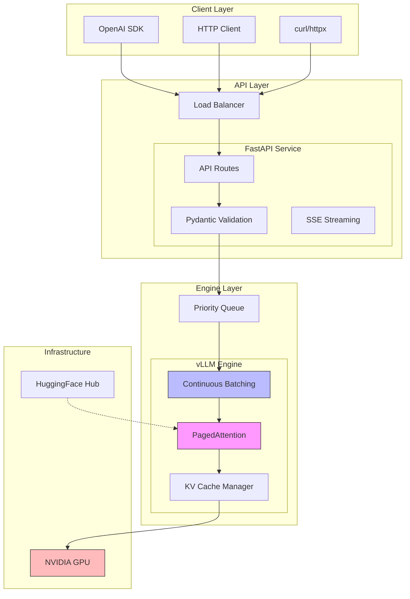
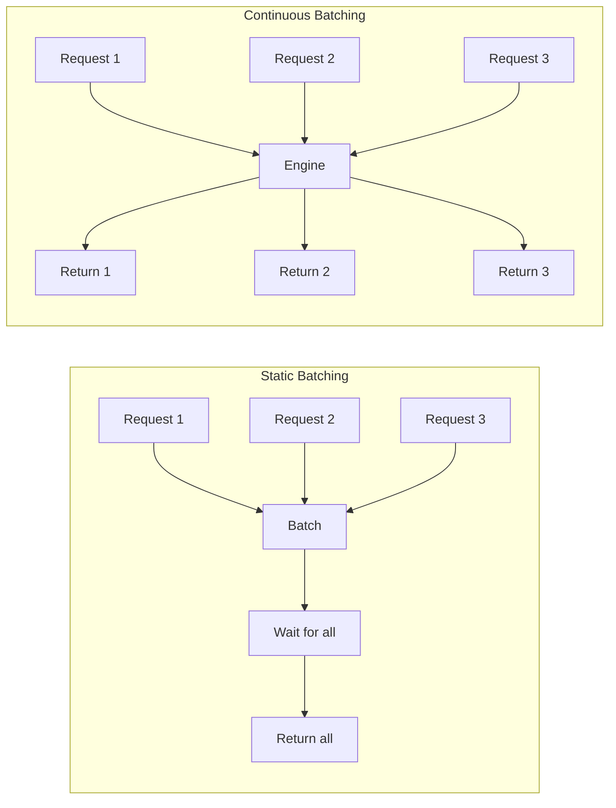

# LLM Inference Service

Production-grade LLM inference service with OpenAI-compatible API, powered by vLLM.

## Overview

This project demonstrates end-to-end AI infrastructure skills for production LLM deployment. It provides a high-performance inference service with continuous batching, streaming support, and Kubernetes-ready architecture.

## Architecture



## Features (Phase 1)

- **OpenAI-Compatible API**: Drop-in replacement for OpenAI endpoints
  - `POST /v1/completions` - Text completions
  - `POST /v1/chat/completions` - Chat completions
  - `GET /v1/models` - List available models

- **High-Performance Inference**: Powered by vLLM
  - PagedAttention for efficient memory management
  - Continuous batching for optimal throughput
  - Async engine with non-blocking generation

- **Streaming Support**: Server-Sent Events (SSE)
  - Real-time token streaming
  - Compatible with OpenAI streaming format

- **Production Ready**
  - Health and readiness probes (`/health`, `/ready`)
  - Graceful shutdown handling
  - Docker and Docker Compose support
  - Type hints and Pydantic validation

## Quick Start

### Prerequisites

- Python 3.11+
- NVIDIA GPU with CUDA 12.1+ (for GPU inference)
- Docker & Docker Compose (optional)

### Installation

```bash
# Clone the repository
git clone https://github.com/z26qin/llm-inference-service.git
cd llm-inference-service

# Install dependencies
pip install -e .

# Or with development dependencies
pip install -e ".[dev]"
```

### Running Locally

```bash
# Start the server
make run

# Or with hot reload for development
make run-dev
```

### Using Docker

```bash
# Build and start with GPU support
make build
make up

# Or without GPU (CPU mode)
make up-cpu

# View logs
make logs
```

### Environment Variables

| Variable | Default | Description |
|----------|---------|-------------|
| `MODEL_NAME` | `TinyLlama/TinyLlama-1.1B-Chat-v1.0` | HuggingFace model ID |
| `TENSOR_PARALLEL_SIZE` | `1` | Number of GPUs for tensor parallelism |
| `GPU_MEMORY_UTILIZATION` | `0.90` | GPU memory fraction to use |
| `MAX_NUM_SEQS` | `256` | Maximum concurrent sequences |
| `HOST` | `0.0.0.0` | Server bind address |
| `PORT` | `8000` | Server port |
| `DEBUG` | `false` | Enable debug mode |
| `HF_TOKEN` | - | HuggingFace API token (for gated models) |

## API Usage

### Text Completion

```bash
curl http://localhost:8000/v1/completions \
  -H "Content-Type: application/json" \
  -d '{
    "model": "TinyLlama/TinyLlama-1.1B-Chat-v1.0",
    "prompt": "The capital of France is",
    "max_tokens": 50,
    "temperature": 0.7
  }'
```

### Chat Completion

```bash
curl http://localhost:8000/v1/chat/completions \
  -H "Content-Type: application/json" \
  -d '{
    "model": "TinyLlama/TinyLlama-1.1B-Chat-v1.0",
    "messages": [
      {"role": "system", "content": "You are a helpful assistant."},
      {"role": "user", "content": "What is machine learning?"}
    ],
    "max_tokens": 200
  }'
```

### Streaming

```bash
curl -N http://localhost:8000/v1/completions \
  -H "Content-Type: application/json" \
  -d '{
    "model": "TinyLlama/TinyLlama-1.1B-Chat-v1.0",
    "prompt": "Count from 1 to 10:",
    "max_tokens": 100,
    "stream": true
  }'
```

### Using OpenAI Python SDK

```python
from openai import OpenAI

client = OpenAI(
    base_url="http://localhost:8000/v1",
    api_key="not-needed"  # No auth in Phase 1
)

# Chat completion
response = client.chat.completions.create(
    model="TinyLlama/TinyLlama-1.1B-Chat-v1.0",
    messages=[
        {"role": "user", "content": "Hello!"}
    ],
    max_tokens=100
)
print(response.choices[0].message.content)

# Streaming
stream = client.chat.completions.create(
    model="TinyLlama/TinyLlama-1.1B-Chat-v1.0",
    messages=[{"role": "user", "content": "Tell me a story"}],
    max_tokens=200,
    stream=True
)
for chunk in stream:
    if chunk.choices[0].delta.content:
        print(chunk.choices[0].delta.content, end="")
```

## Project Structure

```
llm-inference-service/
├── app/
│   ├── __init__.py
│   ├── main.py              # FastAPI application & lifespan
│   ├── api/
│   │   ├── __init__.py
│   │   ├── models.py        # Pydantic schemas (OpenAI format)
│   │   └── routes.py        # API endpoints
│   └── engine/
│       ├── __init__.py
│       ├── vllm_engine.py   # vLLM wrapper
│       └── batching.py      # Priority queue & batch processing
├── Dockerfile               # Multi-stage production build
├── docker-compose.yml       # Local development setup
├── pyproject.toml          # Project configuration
├── Makefile                # Development commands
└── README.md
```

## Design Decisions

### Why vLLM over TGI or Triton?

| Feature | vLLM | TGI | Triton |
|---------|------|-----|--------|
| **PagedAttention** | Yes | Limited | No |
| **Continuous Batching** | Native | Yes | Custom |
| **Python Native** | Yes | Rust | C++ |
| **Ease of Use** | High | Medium | Low |
| **Memory Efficiency** | Excellent | Good | Good |

**Decision**: vLLM provides the best balance of performance and developer experience:
- **PagedAttention** reduces memory fragmentation by 60-80%, enabling higher throughput
- **Continuous batching** automatically groups requests for optimal GPU utilization
- **Pure Python** makes debugging and customization straightforward
- **Native async support** integrates seamlessly with FastAPI

### Continuous vs Static Batching



**Decision**: Continuous batching for lower p99 latency:
- Short requests complete without waiting for long ones
- Better resource utilization during generation
- More predictable latency distribution

### API Design: OpenAI Compatibility

**Decision**: Full OpenAI API compatibility for several reasons:
1. **Drop-in replacement**: Existing OpenAI SDK code works unchanged
2. **Ecosystem**: Compatible with LangChain, LlamaIndex, and other tools
3. **Migration path**: Easy to switch between OpenAI and self-hosted
4. **Documentation**: Well-documented, widely understood format

## Development

### Running Tests

```bash
# Run all tests
make test

# Run with coverage
make test-cov

# Run quick tests only
make test-quick
```

### Code Quality

```bash
# Run linter
make lint

# Auto-fix linting issues
make lint-fix

# Format code
make format

# Type checking
make typecheck

# Run all checks
make check
```

### Testing Endpoints

```bash
# Health check
make test-health

# Readiness check
make test-ready

# Test completion
make test-completion

# Test chat
make test-chat

# Test streaming
make test-stream
```

## Roadmap

- [x] **Phase 1**: Core Serving (FastAPI + vLLM, completions, streaming)
- [ ] **Phase 2**: Caching & Reliability (Redis, rate limiting, health probes)
- [ ] **Phase 3**: Observability (Prometheus, Grafana, structured logging)
- [ ] **Phase 4**: K8s & Autoscaling (HPA, KEDA, GPU metrics)

## Performance Considerations

### Memory Management
- vLLM's PagedAttention reduces KV cache memory waste
- GPU memory utilization configurable (default 90%)
- Automatic memory management for variable-length sequences

### Throughput Optimization
- Continuous batching maximizes GPU utilization
- Configurable max batch size and wait time
- Async processing pipeline

### Latency
- SSE streaming for time-to-first-token optimization
- Priority queue for client tier-based ordering
- Request timeout and cancellation support

## License

MIT License - see [LICENSE](LICENSE) for details.

## Contributing

Contributions are welcome! Please read the contributing guidelines before submitting a PR.
